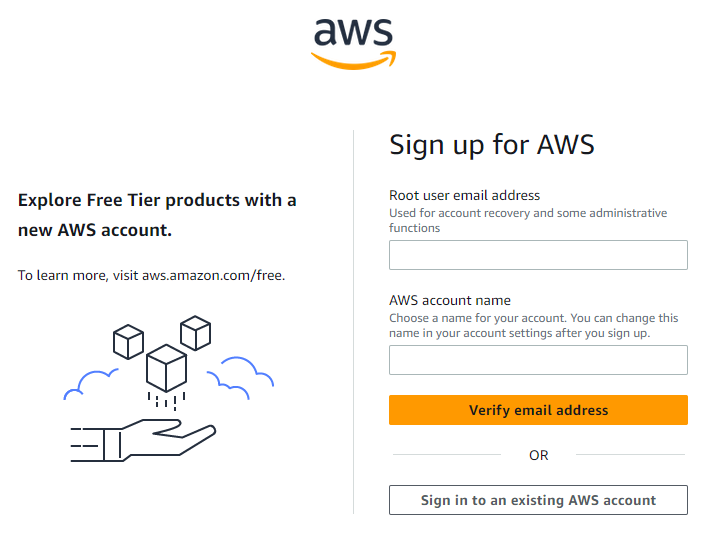

# Host API with AWS

> You should have an express.js API added to a GitHub repo and a MongoDB database hosted on Atlas. The API found in "/resources/" could used.

> Disclaimer: You are personally responsible for any expenses on Amazon Web Service (AWS).

> You should be able to gain access to 100$ credit though AWS Academy. I have not yet figured out how.

<div style="text-align: right">
  
</div>

## Register for AWS

-   Register for a new user on [AWS](https://portal.aws.amazon.com/billing/signup?refid=em_127222&p=ft&z=1&redirect_url=https%3A%2F%2Faws.amazon.com%2Fregistration-confirmation#/start/email "Create account"), or use an exisiting user.
-   Make sure you select all the free options.
-   _void: Will later explain how to claim free credits._



## Virutal Machine (VM)

1. Search and press EC2.
2. Press Launch instance.
3. Name and tags:
    - Name the VM appropriately
4. Application and OS Images (Amazon Machine Image)
    - Under "Quick Start", select Amazon Linux
    - Select Amazon Linux 2023 AMI under Amazon Machine Image
    - Select 64-bit (x86) under architecture
5. Instasnce type
    - t2.micro
6. Key pair (login)
    - To easily connect to the VM though SSH in your terminal, please create a new key pair.
    - Name it appropriately. I will name mine "aws_example_api_key".
    - RSA and .pem
    - Store the key somewhere you will find it. A passwordmanager would be perfect. I will store mine in /dev/SSH_keys/
7. Network settings
    - Allow SSH traffic from anywhere.
    - Allow HTTP traffic from the internet
        - Should be configured for HTTPS at a later stage (not part of this course)
8. Configure storaged
    - Keep as is
9. Launch instance

## Connect though SSH

1. Find the instance launched under EC2 > instances >
2. Make a note of the public IP (IPv4)
3. Press connect
4. Chose SSH client and follow the steps in SSH client or teminal of your choice
5. Accept the connection. Your terminal should look something like this:


## Prepare the VM for hosting of API

1. Update the VM and install necessary packages

<div style="background-color: #000; color: #fff; font-family: monospace; padding: 10px; margin-bottom: 15px">
  sudo yum update<br>
  sudo yum upgrade<br>
  sudo yum install nodejs npm git
</div>

2. Clone the API code from GitHub, navigate to the project and install dependencies. Recreate .env with correct information

<div style="background-color: #000; color: #fff; font-family: monospace; padding: 10px; margin-bottom: 15px">
  git clone < repo_url > <br>
  cd < project_name > <br>
  npm install <br>
  echo 'URI = "< your_mongodb_auth_uri_here >"' >> .env
</div>

3. Add the VM's IP to Atlas' network access under security in the correct cluster

## Run the API with PM2

1. Install PM2 globally and start the API using PM2

<div style="background-color: #000; color: #fff; font-family: monospace; padding: 10px; margin-bottom: 15px">
  sudo npm install -g pm2 <br>
  pm2 start app.js
</div>

> app.js is here the main application file for the API. Replace with whatever your file is called.

## Configure reverse proxy

1. Install Nginx

<div style="background-color: #000; color: #fff; font-family: monospace; padding: 10px; margin-bottom: 15px">
  sudo yum install nginx
</div>

2. Create a new configuration file for Nginx

<div style="background-color: #000; color: #fff; font-family: monospace; padding: 10px; margin-bottom: 15px">
  sudo touch /etc/nginx/conf-d/api.conf <br>
  sudo vim /etc/nginx/conf-d/api.conf <br>
</div>

3. Add the following to the new api.conf file and write the changes

> Remember to actiave "INSERT" with i

```
server {
    listen 80;
    server_name <your_api_domain>;

    location / {
        proxy_pass http://localhost:3000;
        proxy_http_version 1.1;
        proxy_set_header Upgrade $http_upgrade;
        proxy_set_header Connection 'upgrade';
        proxy_set_header Host $host;
        proxy_cache_bypass $http_upgrade;
    }
}
```

> change to whatever port you run the api on, and change to the VMs IP from <your_api_domain>

> write changes and quit vim with "Esc" :wq

4. Restart Nginx for changes to take effect

<div style="background-color: #000; color: #fff; font-family: monospace; padding: 10px; margin-bottom: 15px">
  sudo service nginx restart
</div>

## Test the API

-   Change the environment in postman to production. Remember to change the URL from localhost to your ip

or

-   Test it however you want :D
